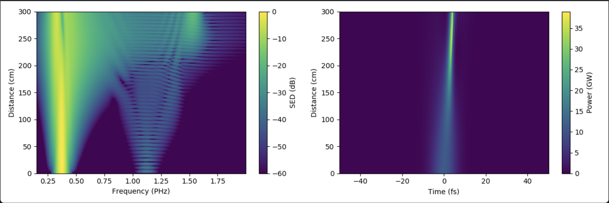

# README - Utilisation de Luna pour la Modélisation et la Conception d’une IA

## Présentation du Projet

Ce projet vise à explorer et améliorer les capacités de modélisation des dynamiques optiques non linéaires à l'aide de la bibliothèque **Luna**. L'objectif principal est de tester les connaissances acquises sur la modélisation de phénomènes physiques avec des méthodes d'intelligence artificielle (IA), en utilisant Luna pour simuler la propagation d'impulsions laser dans des fibres capillaires creuses remplies de gaz.

## À Propos de Luna

[Luna](https://github.com/LupoLab/Luna.jl) est une bibliothèque puissante écrite en **Julia**. Elle permet de simuler les dynamiques optiques non linéaires, notamment à travers l'équation de propagation des impulsions unidirectionnelle (UPPE) et l'équation de Schrödinger non linéaire généralisée (GNLSE). Bien que Luna soit codée en Julia pour des raisons de performance, ce projet exploite également Python pour le traitement des données générées.

## Problématique

Le temps de calcul nécessaire pour simuler la propagation d'impulsions ultrarapides dans une fibre est significatif. L'une des solutions envisagées est l'implémentation d'un modèle d'IA, capable de prédire presque instantanément la forme de l'impulsion à chaque étape de la propagation, réduisant ainsi la nécessité de résoudre l'UPPE à chaque étape.

## Génération du Dataset

Le dataset nécessaire pour entraîner le modèle d'IA est généré en variant plusieurs paramètres physiques tels que le rayon du cœur de la fibre, la pression du gaz, la durée et l'énergie de l'impulsion. Les résultats de chaque simulation incluent les spectres complexes du champ électrique, qui sont ensuite stockés dans des fichiers CSV.

### Paramètres de Simulation :
- **Rayon du cœur de la fibre** : 250 μm
- **Type de gaz** : Azote (N2)
- **Pression du gaz** : de 1 à 4 bars
- **Fenêtre temporelle de l'impulsion** : de 300 à 750 fs
- **Longueur de la fibre** : 1 et 2 mètres
- **Énergie de l'impulsion** : de 50 à 200 μJ
- **Longueur d'onde centrale** : 1030 nm
- **Limites de la grille de fréquences** : de 150 nm à 4 μm

## Modélisation avec les LSTM

La première approche a consisté à utiliser des réseaux de neurones récurrents de type **LSTM** pour prédire l'évolution du spectre à chaque étape de la propagation. Bien que cette méthode ait montré des résultats intéressants, elle présente des limitations importantes en termes de divergence des prédictions au fil des étapes.

## Modélisation avec les Réseaux de Neurones Convolutifs (ConvNet)

Une seconde approche plus robuste a été mise en œuvre avec un réseau de neurones convolutif (**ConvNet**), visant à reproduire les équations de Schrödinger en utilisant les spectres d'entrée et les paramètres conditionnels. Cette méthode a donné des résultats très satisfaisants, avec une erreur moyenne de l'ordre de 6% sur chaque spectre simulé.

### Architecture du Modèle ConvNet :
- **Nombre de caractéristiques** : 4097
- **Nombre d'unités Conv1D** : 128
- **Fonction d'activation** : Tangente hyperbolique (tanh)

## Utilité du Modèle

Ce modèle ConvNet est particulièrement utile pour obtenir rapidement une estimation de la propagation d'impulsions dans diverses conditions expérimentales. Il permet de contourner les limitations des méthodes classiques en réduisant considérablement les temps de calcul, tout en offrant une précision satisfaisante pour la majorité des applications en laboratoire.

## Conclusion

Ce projet démontre la puissance de l'association des simulations physiques avec les techniques d'intelligence artificielle pour améliorer l'efficacité des modélisations optiques non linéaires. Les résultats obtenus ouvrent la voie à de nouvelles approches pour accélérer les simulations et offrir des outils prédictifs robustes dans ce domaine.

---

**Auteur** : Enzo Sebiane  
**Date** : 21 août 2024  
**Institut** : Institut National de la Recherche Scientifique (INRS)
